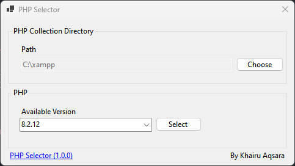

# Windows PHP Selector

This is for my personal use from the first place, I can't find the easies way to change the php version when I need to work on multiple platform.



## How to use
Please download the PHP version that you need, and put it in the single folder with the following structure
```
myphp
---php7.4.1
---php8.0.1
---php8.1.9
---php8.2.12
```

and make sure each `php.ini` is pointing to the correct `ext` folder, in my case I need to change the following part

```
#php8.1.9
extension_dir="C:\php\php8.1.9\ext"
browscap="C:\php\php8.1.9\extras\browscap.ini"
```